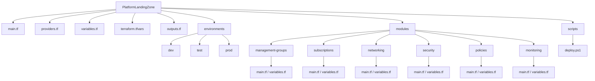
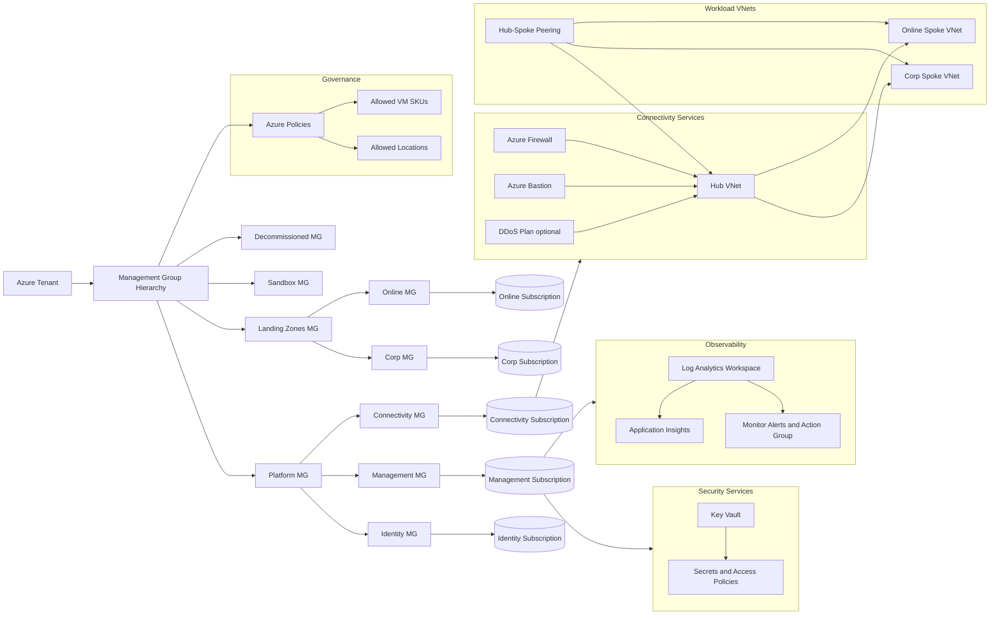

# Platform Landing Zone

Terraform-based Azure Platform Landing Zone with modular governance, networking, security, subscriptions, and monitoring.

## Project Structure

```text
PlatformLandingZone/
|-- main.tf
|-- providers.tf
|-- variables.tf
|-- terraform.tfvars
|-- outputs.tf
|-- environments/
|   |-- dev/
|   |-- test/
|   |-- prod/
|-- modules/
|   |-- management-groups/
|   |-- subscriptions/
|   |-- networking/
|   |-- security/
|   |-- policies/
|   |-- monitoring/
|-- scripts/
|   |-- deploy.ps1
|-- docs/
|   |-- diagrams/
|       |-- project-structure.mmd
|       |-- project-structure.svg
|       |-- azure-architecture.mmd
|       |-- azure-architecture.svg
```

## Diagram: Project Structure





## Diagram: Azure Architecture




